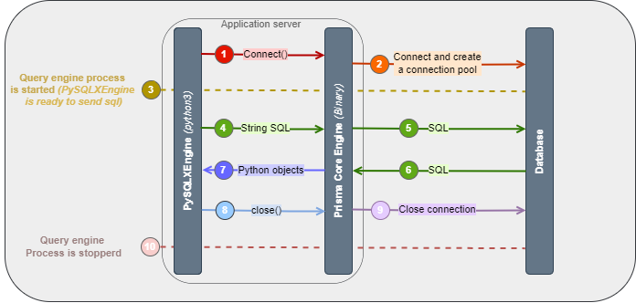

# Core Engine

PySQLXEngine uses [pysqlx-core](https://github.com/carlos-rian/pysqlx-core) to perform database queries. 
Is an extremely fast Python library for communicating with various SQL databases.

[pysqlx-core](https://github.com/carlos-rian/pysqlx-core) package is written entirely in Rust and compiled as a 
Python library using [PyO3](https://pyo3.rs/v0.17.3/) and [PyO3-Asyncio](https://pyo3.rs/v0.13.2/ecosystem/async-await.html).

This core is not so friendly, but maybe you want to use it, feel free to suggest improvements.

As an example, [PySQLXEngine](/) connects to the query engine in order to read and write data in a database:

<figure markdown>
  { width="100%" }
  <figcaption>PySQLXEngine and pysqlx-core</figcaption>
</figure>

[pysqlx-core](https://github.com/carlos-rian/pysqlx-core) uses [Rust Quaint](https://github.com/prisma/quaint) as the abstraction layer to connect to the database.

<small> The [PySQLXEngine](/) documentation uses `Prisma ORM documentation` to specify uri and connectos, as Quaint is the engine underneath Prisma.</small>
