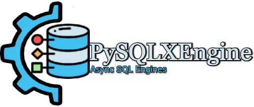

# PySQLXEngine

<p align="center">
  <a href="/"></a>
</p>
<p align="center">
    <em>PySQLXEngine, a minimalist asynchronous SQL engine</em>
</p>

<p align="center">
<a href="https://github.com/carlos-rian/pysqlx-engine/actions?query=workflow%3ATest+event%3Apush+branch%3Amain" target="_blank">
    
</a>
<a href="https://app.codecov.io/gh/carlos-rian/pysqlx-engine" target="_blank">
    
</a>
<a href="https://pypi.org/project/pysqlx-engine" target="_blank">
    
</a>
<a href="https://pypi.org/project/pysqlx-engine" target="_blank">
    
</a>
</p>

---

**Documentation**: <a href="https://carlos-rian.github.io/pysqlx-engine/" target="_blank">https://carlos-rian.github.io/pysqlx-engine/</a>

**Source Code**: <a href="https://github.com/carlos-rian/pysqlx-engine" target="_blank">https://github.com/carlos-rian/pysqlx-engine</a>

---

PySQLXEngine supports the option of sending **raw sql** to your database.

The PySQLXEngine is a minimalist **Async** SQL engine. Currently this lib only supports *asynchronous programming*, you need to code your code using `await` in all methods.


All SQL that is executed using the PySQLXEngine is atomic; that is, only one statement is performed at a time. Only the first one will be completed if you send an Insert and a select. This is one of the ways to deal with SQL ingestion. 
One detail is that `COMMIT` and `ROLLBACK` are automatic!!! This is not changeable


Database Support:

* `SQLite`
* `PostgreSQL`
* `MySQL`
* `Microsoft SQL Server`

OS Support:

* `Linux`
* `Windows` <small>Experimental! Unit tests were not run on Windows.</small>

## Installation


=== "PIP"

    <div class="termy">

    ```console
    $ pip install pysqlx-engine
    ```
    
    </div>

=== "Poetry"

    <div class="termy">

    ```console
    $ poetry add pysqlx-engine
    ```
    
    </div>


## Example

* Create `main.py` file.

```python
import asyncio

from sqlx_engine import SQLXEngine

uri = "file:./db.db"
db = SQLXEngine(provider="sqlite", uri=uri)

async def main():
    await db.connect()
    rows = await db.query(query="select 1 as number")
    print(rows)

asyncio.run(main())
```

* Run it

<div class="termy">

```console
$ python3 main.py

[BaseRow(number=1)]
```
</div>
